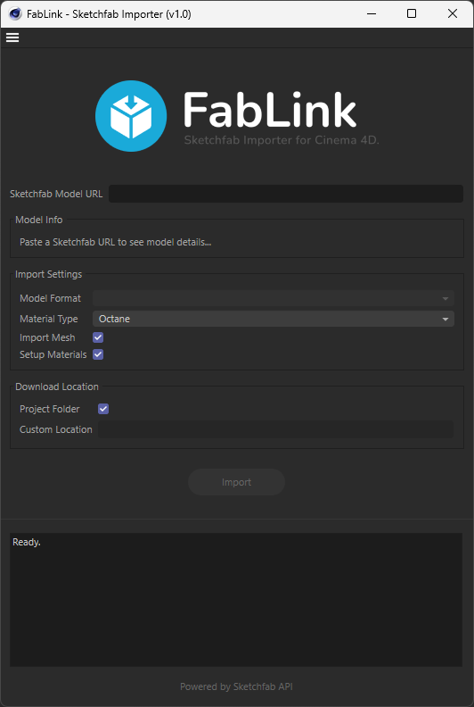
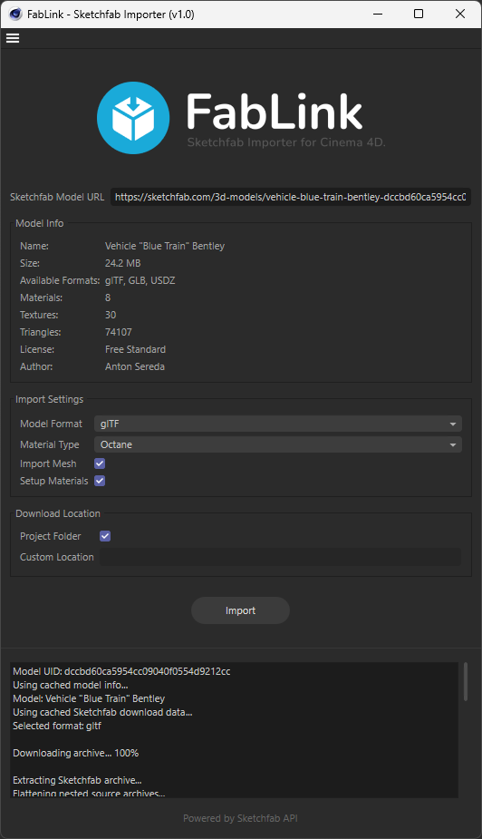

  

# FabLink

A Cinema 4D plugin to download and import 3D models from Sketchfab directly into your scene, while automatically building and wiring fully-optimized Octane or Redshift materials.

Manually downloading, extracting, organizing, and rebuilding materials for downloaded Sketchfab models is a tedious chore. FabLink automates the entire asset pipeline in seconds, handling file conversion, folder organization, relative path updates, and shader-node setup.

The official importer from Sketchfab already exists but it doesn't do everything the way I wanted, so I wrote this plugin mostly for my personal needs but is also available for purchase.

 
<h3 align="center">
  ✦ Available on → <a href="https://oblvyn.gumroad.com/l/fablink_c4d"><u>GUMROAD</u></a> ✦
</h3>
 

## Features

  
  

- **Direct URL Input & Details Fetching**: Paste any Sketchfab model URL to instantly preview key details (Name, Size, Formats, Materials, Textures, Triangles, License, and Author) before starting your download.

- **Fully-Wired Material Creation**: 

  - Automatically setups shader graphs for both **Octane Universal** and **Redshift Standard** materials.

  - Automatically handles packed channels (such as glTF's packed `metallicRoughness` map) using splitters and channel pickers.

- **Asset Pipeline Organization**: Extract and organize downloaded assets cleanly in your active C4D project's `assets/` directory (or a custom path) with textures moved to a unified `/textures` directory and glTF paths updated relatively.

- **Responsive Background Worker**: Downloading and extracting operations are run on a background thread. The dialog remains completely active and responsive, showing live progress and logs.

- **Smart Conflict Handling**: Warns you if an asset has already been imported, giving you options to "Import Existing" or "Download (overwrite)".

 

## Installation

1. Purchase and download the plugin from [Gumroad](https://oblvyn.gumroad.com/l/fablink_c4d).

2. Extract the downloaded zip into your Cinema 4D plugins folder:

    e.g., `C:\Program Files\Maxon Cinema 4D <your_version>\plugins\`

3. Restart Cinema 4D.

4. Run the plugin from:

    `Extensions > FabLink`

*(Tip: To quickly access FabLink, open the Command Manager using `Shift + F12`, search for `FabLink`, and drag-and-drop it directly into your layout).*

 

## First Run (API Key Setup)

To interact with the Sketchfab API, the plugin requires your unique API key:
1. Log in to your account on [Sketchfab](https://sketchfab.com).
2. Navigate to your Account Settings -> **API** section.
3. Copy your API token.
4. Open **FabLink** in C4D and paste the token when prompted. 
5. The API key is stored locally on your machine (`config.json` in the plugin folder) and is never shared.

 

## Important Notes & Troubleshooting

- **C4D glTF Import Bug (Empty Materials)**: Some versions of Cinema 4D (like 2024.4) have a native bug where default materials in glTF/GLB files fail to import, leaving meshes with empty material tags.

    - Fix:
    
        go to... `Edit > Preference (ctrl + E) > Import/Export`

        and set the **Target** value to **Redshift**.

        Its a C4D Bug, might even reset back to **Standard/Physical**.

- **Format Texture Limitations**: Textures will be available/downloaded only with **glTF** format. If you choose **GLB** or **USDZ** formats, FabLink will not extract the textures from these files since they are embedded and I haven't implemented that feature yet, the texture files are exactly same across the format anyways.

- **PBR Metalness/Roughness Only**: FabLink utilizes modern Metalness/Roughness workflows. Models utilizing legacy, deprecated Specular/Glossiness setups are not supported.

- **USDZ Limitation**: Opacity and Ambient Occlusion map detection are not supported for USDZ format. I highly recommend downloading the **glTF** version.

 

## Support

If something breaks or behaves unexpectedly, open an issue in this repository or reach out directly via [Email](mailto:jagfrost2002@gmail.com).

This is a paid plugin and this repository is for distribution and support purposes only.  
See `LICENSE` for details.

---
 
<h3 align="center">
  ✦ Available on → <a href="https://oblvyn.gumroad.com/l/fablink_c4d"><u>GUMROAD</u></a> ✦
</h3>
 
